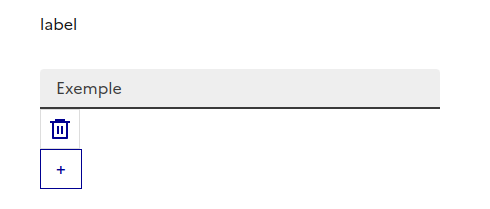
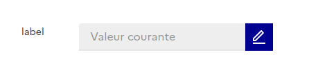
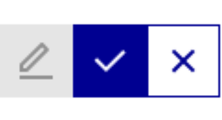

<div align=center>

# @lafabrique/react-fab-dsfr

Librairie de composants génériques React basée sur le [Système Design de l'Etat (DSFR)](https://components.react-dsfr.codegouv.studio/?path=/story/%F0%9F%87%AB%F0%9F%87%B7-introduction--page), la référence officielle pour les interfaces des sites en `.gouv.fr`.

> Cette librairie est développée dans l'écosystème **LaFabrique** du [Service de la Transformation Numérique](https://www.police-nationale.interieur.gouv.fr/nous-decouvrir/notre-organisation/organisation/service-de-transformation-numerique-stn) de la **Police Nationale**.

  <a href="https://github.com/margrosse/react-fab-dsfr/actions/workflows/testUnit.yml">
    
  </a>
  <a href="https://github.com/margrosse/react-fab-dsfr/releases">
  
  </a>

</div>

--- 

## Installation

```bash
# Via GitHub
npm install @lafabrique/react-fab-dsfr@github:margauxFTS/react-fab-dsfr

# Installation des dépendances
npm install @codegouvfr/react-dsfr @mui/material @emotion/react @emotion/styled
``` 
## Usage

Exemple rapide pour mettre en place un champ éditable avec `InlineInput`:

```tsx
import { useState } from "react";
import { InlineInput } from "@lafabrique/react-fab-dsfr";

function MyComponent() {
  const [name, setName] = useState("nom_prenom");

  return (
    <InlineInput
      label="Nom de l'utilisateur"
      value={name}
      name="user-name"
      onChange={(e, newValue) => newValue && setName(newValue)}
      fieldSize={8}
    />
  );
}
```

## Composants

### DynamicInputList

Liste de champs texte dynamique permettant à l'utilisateur d'ajouter ou de supprimer des entrées.

<div align="left">
  
</div>

<br/>

```tsx
import { DynamicInputList } from "@lafabrique/react-fab-dsfr";
```
|Prop|Défaut|Description|
|---|------|-----------|
|`label`| - | Libellé affiché au-dessus de la liste|
|`placeHolder`| - | PlaceHolder affiché dans les champs |
|`values`| - | Tableau des valeurs courantes|
|`onSetValues`| - | Callback appelé à chaque modification|
|`maximumItemNumber`| `10` | Nombre maximum de champs autorisés|
| `itemMaximumLength` | `100` | Longueur maximale de chaque champ |
|`disabled`| `false` | Désactive tous les contrôles|
|`disabledInputs` | `false` | Désactive les champs texte |
|`addAllowed`| `true` | Affiche le bouton d'ajout|
|`deleteAllowed`| `true` | Affiche les boutons de suppression|


--- 

### InlineAutoComplete

Champ avec autocomplétion basculant entre un mode lecture et un mode édition. Basé sur MUI adapté au style DSFR.

<div align="left">
  
</div>

<br/>

```tsx
import { InlineAutoComplete } from "@lafabrique/react-fab-dsfr";
```
|Prop|Défaut|Description|
|----|------|-----------|
|`label`| - | Libellé affiché à gauche du champ|
|`value`| `undefined` | Valeur courante|
|`options`| - | Liste des options disponibles|
|`onChange`| `undefined` | Callback appelé avec l'id de la valeur choisie|
|`noOptionsText`| `""`| Texte affiché quand aucune option ne correspond|
|`editable`| `true` | Affiche ou masque les boutons d'édition|
|`disabled`| `false` | Désactive l'édition et les interactions|
|`fieldSize`| `auto` | Taille de la colonne (système de grille MUI)|
|`nativeInputProps`| `{}`| Props injectées directement dans l'input HTML|
|`nativeButtonsProps`|`undefined`|Props injectées dans les boutons d'action|


---

### InlineInput

Champ texte simple affichable en mode lecture ou édition, incluant les boutons de gestion d'état.

<div align="left">
  
</div>

<br/>

```tsx
import { InlineInput } from "@lafabrique/react-fab-dsfr";
```
|Prop|Défaut|Description|
|----|------|-----------|
|`label`| - | Libellé affiché au-dessus du champ|
|`value`| - | Valeur courante du champ|
|`onChange`|`undefined`|Callback appelé lors de la sauvegarde|
|`editable`|`true`| Permet le basculement en mode édition|
|`disabled`|`false`| Désactive le champ et les contrôles|
|`alertIcon`|`undefined`|Icône DSFR affichée dans le champ|
|`fieldSize`|`auto`| Taille de la colonne (système de grille MUI)|
|`nativeInputProps`| `{}`| Props injectées directement dans l'input HTML|
|`nativeButtonsProps`|`undefined`|Props injectées dans les boutons d'action|


--- 

### InlineSelect

Liste déroulante utilisant `SelectNext` du DSFR, basculant entre mode lecture et édition.

<div align="left">
  
</div>

<br/>

```tsx
import { InlineSelect } from "@lafabrique/react-fab-dsfr";
```
|Prop| Défaut | Description|
|----|--------|------------|
|`label`|-|Libellé affiché à gauche du champ|
|`value`|-|Option sélectionnée courante|
|`options`|-|Liste des options disponibles|
|`onChange`|`undefined`|Callback appelé à la sauvegarde avec la valeur sélectionné|
|`editable`|`true`|Affiche les boutons modifier/sauvegarder|
|`disabled`|`false`|Désactive le champ et les contrôles|
|`fieldSize`|`auto`|Taille de la colonne MUI Grid|
|`nativeButtonsProps`|`undefined`|Props injectées dans les boutons d'action|


----

### DateTimeInline

```tsx
import DateTimeInput from "@lafabrique/react-fab-dsfr";
```
|Prop| Défaut | Description|
|----|--------|------------|
|`onChange`|`undefined`| |
|`dateProps`| - | |
|`timeProps`|`undefined`| |
|`withTime`|`false`| |
|`gridProps`|`undefined`| |

----

### InlineSaveCancelButtons

Composant utilitaire interne utilisé pour afficher les boutons d'action (modifier, enregistrer, annuler).

<div align="left">
  
</div>

<br/>

```tsx
import { InlineEditSaveCancelButtons } from "@lafabrique/react-fab-dsfr";
```
|Prop|Défaut|Description|
|----|------|-----------|
|`modifying`|-|Etat actuel du composant (true si en cours d'édition)|
|`setModifying`|-|Fonction de mise à jour de l'état d'édition|
|`onModify`|-|Action declenchée lors du clic sur "modifier"|
|`onSave`|-|Action déclenchée lors du clic sur "enregistrer"|
|`onCancel`|`undefined`|Action optionnelle déclenchée lors du clic sur "annuler"|
|`disabled`|`false`|Désactive le bouton d'édition|

